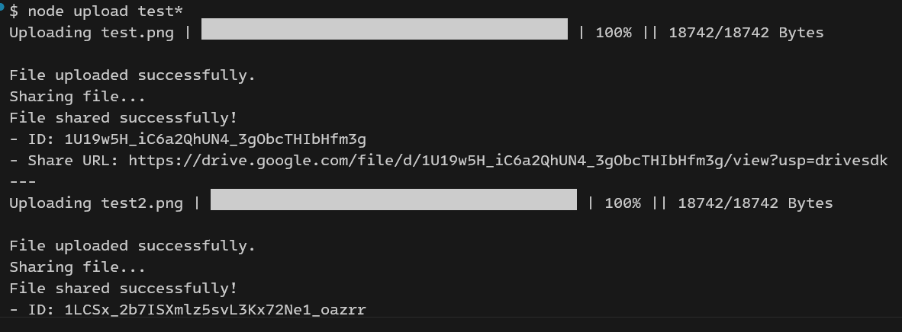

# Google Drive CLI Uploader

A Node.js script to upload one or more files to Google Drive, share them publicly, and get the shareable link. The script features a progress bar for each upload.

### Example Output

Here is an example of the script in action, uploading two files:

## Features

*   Upload multiple files in a single command.
*   Authenticates securely with Google OAuth 2.0.
*   Displays a real-time progress bar for each upload.
*   Automatically creates a public, read-only shareable link for each file.
*   Can be aliased for easy access from anywhere in your terminal.

## Setup Instructions

1.  **Clone the Repository:**
    `git clone https://github.com/pguardiario/gdrive-upload.git`
    `cd your-repo-name`

2.  **Install Dependencies:**
    `npm install`

3.  **Get Google Credentials:**
    *   Go to the [Google Cloud Console](https://console.cloud.google.com/) and create a new project.
    *   Enable the **Google Drive API**.
    *   Go to **Credentials**, click **+ CREATE CREDENTIALS** -> **OAuth client ID**.
    *   Choose **Web application** as the application type.
    *   Under "Authorized redirect URIs", add `http://localhost:5135/oauth2callback`.
    *   Click **CREATE** and then **DOWNLOAD JSON**.

4.  **Add Credentials to Project:**
    *   Rename the downloaded file to `credentials.json`.
    *   Place this `credentials.json` file in the root of the project directory. **This file is listed in `.gitignore` and will not be committed.**

5.  **Run the Script:**
    *   The first time you run the script, it will open a browser window for you to authenticate with your Google account.
    *   `node upload.js /path/to/your/file.txt "another file.zip"`

## Creating a Bash Alias (Optional but Recommended)

To run this script from any folder, you can create a bash alias.

1.  Get the full path to the script (e.g., `pwd` inside the project folder).
2.  Edit your `~/.bashrc` file (`nano ~/.bashrc`).
3.  Add this line, replacing the path with your own:
    `alias gdrive-upload='node /full/path/to/your/google-upload/upload.js'`
4.  Reload your bash profile with `source ~/.bashrc`.
5.  You can now use `gdrive-upload my-file.txt` from anywhere!